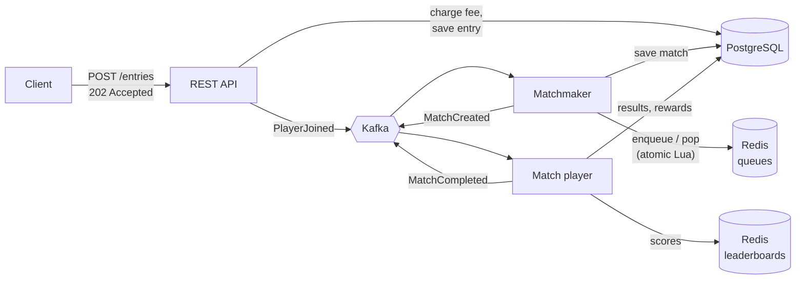

# Game Matchmaking Service

[](https://github.com/yagiz827/game-matchmaking-service/actions/workflows/ci.yml)

An event-driven tournament matchmaking backend. Players from five countries join a tournament queue. As soon as one player from **every** country is waiting, the service forms a match, plays it and updates the leaderboards. All of this happens asynchronously in the background.

**Stack:** Java 21 · Spring Boot 4 · PostgreSQL · Redis · Kafka · Flyway · Testcontainers · Docker · GitHub Actions

## Architecture



Each technology has one job:

| Component | Role | Why |
|---|---|---|
| **PostgreSQL** | Players, tournaments, entries, matches, results | Source of truth; transactions and constraints protect coins and entries |
| **Redis** | Live waiting queues (lists) and leaderboards (sorted sets) | In-memory speed; atomic Lua scripts for multi-step queue operations |
| **Kafka** | `player-joined`, `match-created` and `match-completed` events | Decouples the API from matchmaking; retries and dead-letter topics on failure |

### Request flow

1. `POST /tournaments/{id}/entries` checks eligibility (level ≥ 20, enough coins), charges the entry fee and saves the entry as `QUEUED` in one transaction. It then publishes `PlayerJoined` and returns **202 Accepted** right away.
2. The matchmaker consumes the event, pushes the player onto their country's Redis queue, and pops complete groups (one player per country).
3. Each group is saved as a match, the entries become `MATCHED`, and `MatchCreated` is published.
4. The match player consumes that event, ranks the players, pays the top two, marks the entries `FINISHED`, updates the leaderboards and publishes `MatchCompleted`.

## Design decisions

**Race-free matchmaking with Redis Lua scripts.** "If every country's queue has a player, take the first from each" is several Redis commands. If they ran separately, two matchmakers could both see a full set of queues and put the same player into two matches. [`pop_match.lua`](src/main/resources/scripts/pop_match.lua) runs the whole check-and-pop as one atomic operation, so any number of service instances can share the queues without locks. [`MatchmakingQueueIT`](src/test/java/com/yagiztufek/matchmaking/queue/MatchmakingQueueIT.java) proves it: 16 concurrent workers drain 1,000 queued players, and no player ever lands in two matches.

**PostgreSQL is the source of truth; Redis is an index.** Before a popped group becomes a match, its entries are locked (`SELECT … FOR UPDATE`) and checked to still be `QUEUED`. A stale queue entry can never create a bad match. Valid players from a rejected group go back to the *front* of their queue, so they keep their place in line.

**Idempotent consumers for at-least-once delivery.** Kafka may deliver an event more than once, so every handler is safe to repeat:
- `PlayerJoined` only queues players whose entry is still `QUEUED`.
- Playing a match locks the match row and does nothing if it's already `COMPLETED`.
- Leaderboards use `ZADD` with the absolute score from PostgreSQL, not `ZINCRBY`, so a replay can't double-count points.

**Reconciliation instead of losing work.** A database commit and a Kafka publish can't be atomic. If the process dies between them, [`ReconciliationJob`](src/main/java/com/yagiztufek/matchmaking/matchmaking/ReconciliationJob.java) periodically re-queues entries stuck in `QUEUED` and republishes matches stuck in `CREATED`. Both repairs are idempotent.

**Other details**
- Money-safe updates: coin changes happen under row locks, and a `CHECK (coins >= 0)` constraint backs up the application check.
- Deadlock avoidance: rows are always locked in ascending id order.
- Kafka events are keyed by tournament id, so each tournament's events stay ordered within one partition.
- Failed messages are retried with exponential backoff, then moved to a dead-letter topic instead of blocking the partition.
- Redis keys use `{t<id>}` hash tags, so a tournament's keys share a Redis Cluster slot, which multi-key scripts require.
- HTTP requests and blocking calls run on Java 21 virtual threads.

## Running it

### Option 1: GitHub Codespaces (nothing to install)

Click **Code → Codespaces → Create codespace**, then in its terminal:

```bash
docker compose up --build -d
./scripts/demo.sh
```

### Option 2: Locally with Docker

```bash
docker compose up --build
```

To run the app from your IDE instead, start only the infrastructure with `docker compose up postgres redis kafka`, then run `MatchmakingApplication`.

**API docs:** http://localhost:8080/swagger-ui.html · **Health:** http://localhost:8080/actuator/health

`scripts/demo.sh` creates five players (one per country), levels them up to the entry requirement, enters them and prints the final leaderboard.

To try individual endpoints, open [`requests.http`](requests.http) in VS Code with the [REST Client](https://marketplace.visualstudio.com/items?itemName=humao.rest-client) extension, or in IntelliJ, and click **Send Request**.

## API

| Method | Path | Description |
|---|---|---|
| `POST` | `/api/v1/players` | Create a player (`{"username", "country"?}`; the country is random if omitted) |
| `GET` | `/api/v1/players/{id}` | Player profile, level and coins |
| `POST` | `/api/v1/players/{id}/level-up` | Level up (+25 coins) |
| `POST` | `/api/v1/tournaments` | Create a tournament |
| `POST` | `/api/v1/tournaments/{id}/entries` | Enter a player (`{"playerId"}`). Returns `202 Accepted` |
| `GET` | `/api/v1/tournaments/{id}/entries/{playerId}` | Entry status: `QUEUED` → `MATCHED` → `FINISHED` |
| `GET` | `/api/v1/tournaments/{id}/queue` | Number of players waiting per country |
| `GET` | `/api/v1/tournaments/{id}/leaderboard?country=TR&limit=10` | Overall or per-country leaderboard |
| `POST` | `/api/v1/tournaments/{id}/close` | Stop accepting entries |
| `GET` | `/api/v1/matches/{id}` | Match standings |

Errors are returned as RFC 9457 problem details: `404` not found, `409` duplicate entry or closed tournament, `422` not eligible.

## Game rules

- Entering costs **1,000 coins** and requires **level 20**. New players start at level 1 with 5,000 coins.
- A match needs one player from each country: 🇹🇷 TR, 🇺🇸 US, 🇬🇧 UK, 🇫🇷 FR, 🇩🇪 DE.
- Players are knocked out one at a time in random order, and every survivor earns a point per round, so the scores run from 4 (winner) down to 0.
- The winner gets **10,000** coins and the runner-up **5,000**.

All values are configurable in [`application.yml`](src/main/resources/application.yml).

## Tests

```bash
./mvnw verify
```

- **Unit tests:** scoring, rewards, eligibility, idempotent replays and stale-group handling.
- **Integration tests** (Testcontainers, run in CI):
  - the Redis queue scripts, including the concurrency test above
  - the full flow through the HTTP API with real PostgreSQL, Redis and Kafka

Integration tests are skipped automatically when Docker isn't available.

## Possible next steps

- Transactional outbox, to make "save entry and publish event" atomic without relying on reconciliation
- Skill-based matchmaking using a Redis sorted set scored by rating, with the allowed range widening the longer a player waits
- ShedLock so only one instance runs the reconciliation job at a time
- Metrics for queue wait time and match throughput (Micrometer and Prometheus)

---

A rewrite of my earlier [tournament and matchmaking project](https://github.com/yagiz827/mongoandmysql). The original kept the queues in a MongoDB document that was read, modified in memory and saved back, which allowed lost updates and duplicate matches under concurrent joins. It also ran synchronously.
